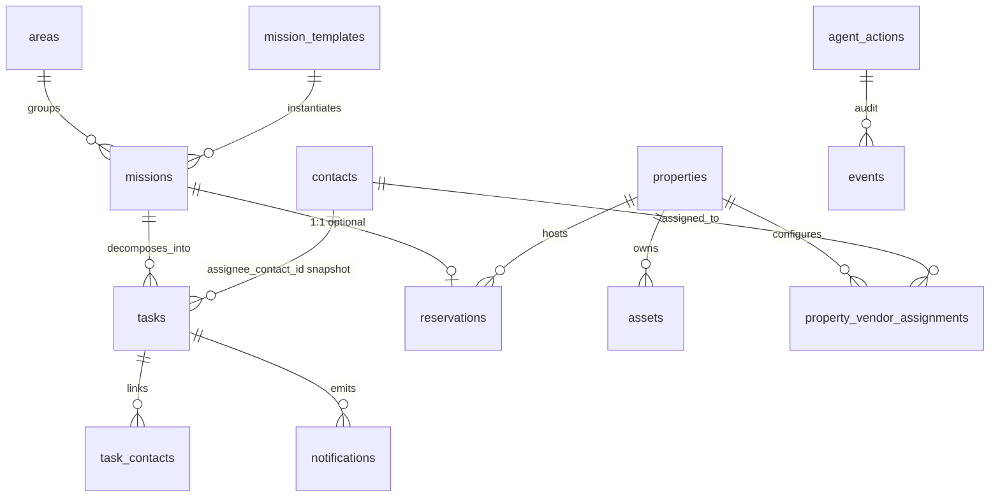
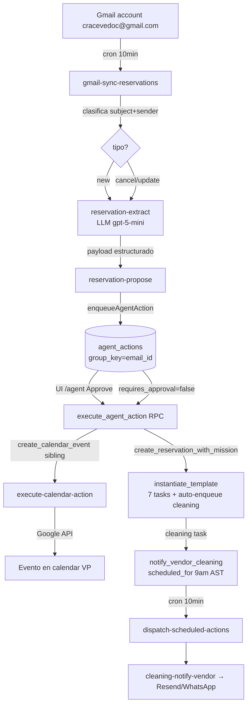

# Mission Control — System Specification v2

> Borrador generado al cierre del Sprint 3.1 (Cleaning Coordinator). Documento técnico vivo para Carlos y para próximas instancias de IA que retomen el proyecto. Tono honesto: marca claramente lo que está implementado, en construcción, deferred o descartado.
>
> _Última verificación global: 2026-05-17, post Sprint 3.1._

---

## TOC

1. Resumen ejecutivo
2. Visión arquitectónica
3. Stack y entorno
4. Modelo de datos
5. Phase 1 — CRUD personal
6. Phase 2 — Reservation Autopilot
7. Phase 3 — Sub-agentes
8. Patrones técnicos transversales
9. Integraciones externas
10. Seguridad
11. Operaciones y cron jobs
12. Tech debt acumulado
13. Roadmap
14. Glossary
15. Apéndices (A: cambios vs SPEC v1, B: decisiones arquitectónicas, C: bugs históricos)

---

## 1. Resumen ejecutivo

Mission Control es la app personal de Carlos para gestionar dos cosas en una sola interfaz: (a) las reservas del Airbnb **Vista Pelícano** con todo su ciclo operacional (limpieza, supplies, comunicación con huésped, calendar sync, finanzas), y (b) sus tareas/missiones personales — proyectos, finanzas personales, salud, vehículo, etc. La app no es un producto comercial: es la herramienta diaria de un solo usuario, optimizada para reducir carga cognitiva.

El modelo central es **agéntico**: en vez de UIs de formularios, el sistema **propone acciones** (parsea emails, sugiere tareas, recuerda escalaciones) que se materializan en una **queue auditable** (`agent_actions`). Cada acción tiene su lifecycle `proposed → executed/rejected/failed/skipped`, audit trail completo, e idempotencia. Carlos aprueba en lote cuando hace falta (`/agent`), y el resto corre automático vía cron + edge functions.

Filosofía operativa: **human-in-the-loop para decisiones críticas, automatización para lo deterministico**. Soft-delete por default, eventos semánticos en `events`, RLS estricta por `user_id`. No es GxP, no es regulatorio — es honestidad técnica para una herramienta personal.

**Estado actual:** Phase 1 (CRUD) ✅, Phase 2 (Reservation Autopilot) ✅ validado E2E, Phase 3.1 (Cleaning Coordinator) ✅, Phases 3.2–3.4 ⏳ roadmap, Phase 4 (Chamón conversacional WhatsApp) ⏳.

---

## 2. Visión arquitectónica

```
┌──────────────────────────────────────────────────────────────────┐
│  Cliente: React + TanStack Start (src/routes/, src/components/)  │
└────────────────────────────┬─────────────────────────────────────┘
                             │ supabase-js (JWT)
                             ▼
┌──────────────────────────────────────────────────────────────────┐
│  Lovable Cloud (Supabase)                                        │
│  ┌───────────────┐  ┌────────────────┐  ┌───────────────────┐   │
│  │  Postgres     │  │  Auth          │  │  Storage          │   │
│  │  + RLS        │  │  (email+pass)  │  │  (attachments)    │   │
│  │  + RPCs       │  └────────────────┘  └───────────────────┘   │
│  │  + triggers   │                                               │
│  │  agent_actions│◄──── bus unificado de acciones ──────────────┐│
│  │  events       │◄──── audit trail                              ││
│  └───────────────┘                                               ││
└──────────────┬─────────────────────────────┬─────────────────────┘│
               │ pg_net (cron)               │ invoke (client/srv)  │
               ▼                             ▼                      │
┌──────────────────────────────────────────────────────────────────┐│
│  Edge Functions (Deno)                                           ││
│  • gmail-sync-reservations  • reservation-extract                ││
│  • reservation-propose      • execute-calendar-action            ││
│  • cleaning-notify-vendor   • dispatch-scheduled-actions         ││
│  • escalate-cleaning-check  • send-digest-cron/now               ││
│  • chamon-* (query, create-mission/task, update-task)            ││
└──────┬──────────┬──────────┬──────────┬──────────┬───────────────┘│
       ▼          ▼          ▼          ▼          ▼                │
   ┌───────┐ ┌────────┐ ┌────────┐ ┌────────┐ ┌──────────┐         │
   │ Gmail │ │ Resend │ │ Google │ │WhatsApp│ │ElevenLabs│         │
   │ API   │ │ email  │ │Calendar│ │Cloud   │ │ConvAI    │         │
   └───────┘ └────────┘ └────────┘ └────────┘ └──────────┘         │
                                                                    │
       ┌──────────────────────────────────────────────┐             │
       │ Lovable AI Gateway → OpenAI/Anthropic (LLM) │─────────────┘
       └──────────────────────────────────────────────┘
```

### Patrón arquitectónico central: la cola `agent_actions`

Todas las operaciones no triviales pasan por la tabla `agent_actions`. Cada row representa una **intención**, validada con Zod antes de insertar, con su propio `idempotency_key`, optional `scheduled_for` para diferimiento, optional `group_key` para acciones sibling, y `requires_approval` para gatear human-in-the-loop.

**Ciclo de vida:**

```
            ┌─────────────┐
  enqueue → │  proposed   │
            └──┬──────┬───┘
   approve/    │      │   reject
   dispatch    ▼      ▼
            ┌─────────────┐         ┌───────────┐
            │  executing  │ ───────►│ executed  │
            └──┬──────┬───┘         └───────────┘
               │      │             ┌───────────┐
               │      └────────────►│  failed   │
               │                    └───────────┘
               │                    ┌───────────┐
               └───────────────────►│  skipped  │
                                    └───────────┘
```

Capas:
- **propose** — quien sea (cron de email-sync, UI de Carlos, sub-agente futuro) llama a `enqueueAgentAction()` validando payload contra schema Zod (`supabase/functions/_shared/agent-actions.ts`).
- **dispatch** — `dispatch-scheduled-actions` cron despacha acciones con `scheduled_for <= now()`. Para aprobación manual, la UI `/agent` agrupa por `group_key`.
- **execute** — RPC `execute_agent_action(_action_id)` con branches por `action_type`. Para branches que requieren red (calendar, email, whatsapp), el RPC delega a edge function.
- **finalize** — RPCs específicas (`finalize_calendar_action`, `finalize_notify_vendor`) cierran el lifecycle desde el lado de la edge function.
- **audit** — trigger `audit_change` materializa cada INSERT/UPDATE/DELETE en `events`.

_(source: schema introspection + `supabase/functions/_shared/agent-actions.ts` + migraciones Sprint 2.3–3.1)_

---

## 3. Stack y entorno

| Capa | Tecnología |
|------|------------|
| Frontend | React 19 + Vite 7 + TypeScript strict + Tailwind v4 + shadcn/ui + TanStack Start v1 + TanStack Query |
| Backend | Supabase (Postgres + Auth + Storage) vía Lovable Cloud |
| Edge functions | Deno + esm.sh |
| Auth | Email + password únicamente. **Google OAuth deshabilitado intencionalmente** (re-evaluar en Phase 4 si lo necesita Chamón) |
| i18n | ES/EN toggle, persistido en `localStorage` (`src/lib/i18n.tsx`) |
| Tipografía | IBM Plex Sans (UI) + IBM Plex Mono (datos/status) |
| LLM extracción | `openai/gpt-5-mini` vía Lovable AI Gateway (≈ $0.0024/email) |
| Email outbound | **Resend (HTTP directo)**. El intento de usar connector_gateway se removió en Sprint 3.1 |
| Mensajería | WhatsApp Business Cloud API — **dormante** (código listo, esperando secrets + template aprobado) |
| Calendar | Google Calendar API vía Lovable Cloud connector gateway |
| Voice | ElevenLabs ConvAI (agente Chamón) — en construcción |

### Identificadores ground truth (NO inventar)

| Entidad | UUID |
|---|---|
| Carlos `user_id` | `1d71c262-7c8a-4a1f-84ef-1120f02d3321` |
| Property **Vista Pelícano** | `ba09bfbe-4c4f-4d96-962b-1a14ef23f732` |
| Area **Vista Pelícano** | `3021542d-4034-4086-b0d4-63e6cd743e19` |
| Mission template **Nueva reserva Airbnb** | `80eeafac-c10a-44ce-a81c-2092ec8d9057` |
| Calendar ID VP | `c7e1950f454dc5bee5db7832756648a722be714cccddb09d329f2dc4597b4df1@group.calendar.google.com` |
| Timezone canónica | `America/Puerto_Rico` |

Otras areas activas: Financiero, Vehículo, Personal, Trabajo. _(source: `psql properties / areas / mission_templates`)_

### Constantes operacionales

- Gmail account de Carlos: `cracevedoc@gmail.com`
- Cleaning notify scheduled time: **9:00 AM America/Puerto_Rico** un día antes del check-in / día del check-out
- Escalación cleaning: **24h** antes de check-in si task sigue en `assigned` o `notified`

_(source: migraciones Sprint 3.1 + `supabase/functions/cleaning-notify-vendor/index.ts`)_

---

## 4. Modelo de datos

### ERD (high-level)



### Tablas core (estado actual del schema)

Convenciones transversales que aplican a casi todas: `user_id` + RLS `auth.uid()=user_id`, `created_at`/`updated_at` + `created_by`/`updated_by`, soft-delete con `deleted_at`/`deleted_by`, trigger `audit_change` que escribe en `events`.

| Tabla | Propósito | Notas |
|---|---|---|
| `profiles` | 1 row por user. Timezone, idioma, digest_hour | `timezone='America/Puerto_Rico'` default |
| `areas` | Categorías top-level (Vista Pelícano, Personal, etc.) | Soft-delete |
| `missions` | Proyectos/objetivos. Pueden estar vinculados a `reservations` (1:1) o ser standalone | `agent_action_id` linkea origen agéntico |
| `tasks` | Unidad atómica de trabajo. Columnas vendor: `assignee_contact_id`, `vendor_status`, `notified_at`, `confirmed_at`, `escalated_at`. Template offset: `template_task_offset_days`, `template_task_offset_anchor` (`check_in`/`check_out`) | CHECK status: `todo/doing/waiting/done`. CHECK vendor_status: `assigned/notified/confirmed/escalated/done` |
| `mission_templates` | Plantillas con `task_offsets jsonb[]` (title, due_offset_days, relative_to, friction_level, is_today). El template **Nueva reserva Airbnb** define 7 tasks | Ver §6 para detalle |
| `reservations` | Reservas Airbnb. `confirmation_code` unique, `source` (airbnb/vrbo/booking/direct/manual/email_detected), `status` (detected/confirmed/cancelled), `agent_action_id`, `calendar_event_id` | Linkea a `mission_id` (1:1) y `property_id` |
| `properties` | `calendar_id`, `calendar_timezone`, `default_area_id`. **Feature flag**: property sin `calendar_id` skipea calendar sync silenciosamente | |
| `assets` | Inventario por propiedad (electrodomésticos, etc.) | Phase 3.2 Maintenance Memory lo usará |
| `contacts` | Huéspedes, vendors, contactos personales. `categories text[]` (vendor_cleaning, vendor_maintenance, vendor_gardening, guest, personal, professional), `whatsapp_phone`, `preferred_channel` (`email`/`whatsapp`/NULL=auto) | CHECK preferred_channel: NULL/email/whatsapp |
| `task_contacts` | Many-to-many task↔contact | Sin update |
| `property_vendor_assignments` | Vendor primary/backup por (property, vendor_category). UNIQUE partial index `property_vendor_primary_unique` sobre `(property_id, vendor_category) WHERE is_primary AND deleted_at IS NULL` | Reasignación atómica vía RPC `reassign_vendor_primary` |
| `agent_actions` | **Bus central**. Ver §2 | UNIQUE partial index `(user_id, idempotency_key) WHERE idempotency_key IS NOT NULL` |
| `events` | Audit trail semántico | CHECK entity_type incluye ambos `property_vendor_assignment` y `property_vendor_assignments` (tech debt §12) |
| `notifications` | Log de cada email/WhatsApp enviado. type: `digest/alert/overdue/vendor_cleaning_notify/vendor_notify_failed/vendor_notify_skipped/vendor_escalation` | INSERT bloqueado por RLS — solo service-role via RPC `finalize_notify_vendor` |
| `attachments` | Files attached a task/mission/asset | Storage paths |
| `email_ingestion_log` | 1 row por mensaje procesado del Gmail sync | Tracking idempotency por `gmail_message_id` |
| `vendors` | Tabla legacy pre-categorización en `contacts`. Coexiste pero no se usa para flows nuevos | Considerar deprecation |
| `xp_events`, `user_stats`, `achievements`, `user_achievements` | Gamificación XP. RLS read-only para usuario | RPCs `award_xp`, `evaluate_achievements`, `compute_level` |

### RPCs activas (post Sprint 3.1)

`audit_change` (trigger), `award_xp`, `chamon_search`, `compute_level`, `enqueue_escalate_no_response`, `evaluate_achievements`, `execute_agent_action`, `execute_escalate_action_service`, `finalize_calendar_action`, `finalize_notify_vendor`, `handle_new_user`, `instantiate_template`, `mission_xp_on_complete`, `pick_scheduled_notify_actions`, `reassign_vendor_primary`, `resolve_pending_reservation_id`, `set_updated_at`, `set_user_id_on_insert`, `task_completion`, `task_xp_on_complete`.

_(source: `pg_proc` introspection)_

---

## 5. Phase 1 — CRUD personal ✅

CRUD básico sobre `areas`, `missions`, `tasks`, `contacts`, `attachments`, `properties`, `assets`. Drag-and-drop reordering en algunas vistas (sort_order). Gamificación XP corriendo. UIs: `/today`, `/missions/:id`, `/dashboard`, `/contacts`, `/settings`, `/achievements`. Esta capa es base estable — no es la parte interesante del sistema. _(source: `src/routes/_authenticated.*.tsx`)_

---

## 6. Phase 2 — Reservation Autopilot ✅ (validado E2E)

**La sección más importante del documento.** Pipeline end-to-end desde un email entrando a Gmail hasta una mission + 7 tasks + evento de Google Calendar.

### Flujo high-level



### Pasos detallados

1. **Email ingestion** — `gmail-sync-reservations` cron `*/10 * * * *` (`supabase/functions/gmail-sync-reservations/index.ts`). Auth Bearer desde `vault.cron_bearer`. Lee `newer_than:30d`, clasifica como `new/cancel/update` por regex sobre subject. Inserta 1 row en `email_ingestion_log` por mensaje (idempotency por `gmail_message_id`).
2. **Extracción** — `reservation-extract` llama a Lovable AI Gateway (`openai/gpt-5-mini`) con system prompt que extrae JSON estructurado: `confirmation_code, guest_name, guest_email, check_in_date, check_out_date, number_of_guests, payout_amount, cleaning_fee, taxes_or_fees`. Costo ~$0.0024/extracción.
3. **Propuesta** — `reservation-propose` encola agent_actions agrupados por `group_key` = `gmail_message_id`. Para `new`: dos acciones siblings — `create_reservation_with_mission` + `create_calendar_event`. El calendar event usa `pending_reservation_confirmation_code` + `pending_check_in_date` para que `resolve_pending_reservation_id` lo amarre al reservation_id real cuando se ejecute.
4. **Aprobación humana opcional** — UI `/agent` (`src/routes/_authenticated.agent.tsx`) agrupa por `group_key`, muestra Proposal Group con "Approve all" que ejecuta secuencialmente por `created_at ASC` (importante: garantiza que la reservation existe antes de que el calendar event la busque).
5. **Ejecución** — `execute_agent_action(_action_id)` con branches por `action_type`. Branches actuales: `create_task`, `create_mission`, `create_reservation`, `update_task`, `create_reservation_with_mission`, `cancel_reservation`, `update_reservation`, `create_calendar_event`, `update_calendar_event`, `delete_calendar_event`, `notify_vendor_cleaning`, `mark_vendor_confirmed`, `escalate_vendor_no_response`. Validación Zod en `_shared/agent-actions.ts` PAYLOAD_SCHEMAS.
6. **Calendar sync** — `execute-calendar-action` edge function. Event ID determinístico `mc{sha256_30char_hex}` para idempotency. Maneja 409 (event existente → update), 404 (deletado externamente → skip o re-create). Property sin `calendar_id` → skip silencioso con `skipped_reason='no_calendar_id_on_property'`.
7. **Instanciación de tasks** — `instantiate_template(_mission_id, _template_id, _anchor_dates jsonb)` lee `task_offsets`, calcula `due_date` según `relative_to` + `due_offset_days`, persiste `template_task_offset_days/anchor` para recálculo posterior. **Sprint 3.1 added**: si task title matchea `^Coordinar limpieza pre-checkin` → auto-enqueue `notify_vendor_cleaning` con `scheduled_for=check_in-1day @ 9am AST`, vendor desde `property_vendor_assignments`. Mismo para `^Coordinar limpieza post-checkout` con anchor check_out.
8. **Recálculo en update** — `update_reservation` con `recalc_task_dates=true` recalcula todas las tasks vivas usando offsets persistidos.

### Template "Nueva reserva Airbnb" (7 tasks)

| # | Title | offset_days | anchor | friction | is_today |
|---|---|---|---|---|---|
| 1 | Confirmar detalles de la reserva con el huésped | -7 | check_in | 2 | false |
| 2 | Coordinar limpieza pre-checkin | -1 | check_in | 3 | false |
| 3 | Revisar inventario y supplies | -1 | check_in | 2 | false |
| 4 | Enviar instrucciones de acceso al huésped | -1 | check_in | 2 | false |
| 5 | Confirmar check-in del huésped | 0 | check_in | 1 | true |
| 6 | Coordinar limpieza post-checkout | 0 | check_out | 3 | true |
| 7 | Solicitar review al huésped | +1 | check_out | 1 | false |

_(source: `psql mission_templates.task_offsets`)_

---

## 7. Phase 3 — Sub-agentes

### 7.1 Cleaning Coordinator ✅ (Sprint 3.1 cerrado)

**Modelo de datos:**
- `contacts.categories text[]` con valores `vendor_cleaning/vendor_maintenance/vendor_gardening/guest/personal/professional`.
- `contacts.whatsapp_phone` (E.164 normalizado al blur — helper `src/lib/phone.ts`).
- `contacts.preferred_channel`: NULL = "Auto", `email`, o `whatsapp`. UI mapea radio "Auto" ↔ NULL en ambas direcciones.
- `property_vendor_assignments` con UNIQUE partial index garantiza máximo 1 primary activo por (property, category).
- `tasks.assignee_contact_id` snapshot del vendor al crearse la task (no se re-asigna cuando cambia primary — preserva auditoría).

**Flujo cleaning notify:**
1. `instantiate_template` detecta task de cleaning, busca primary vendor activo, encola `notify_vendor_cleaning` con `scheduled_for`.
2. `dispatch-scheduled-actions` cron `*/10min` selecciona vía `pick_scheduled_notify_actions(_limit)`, hace HTTP POST a `cleaning-notify-vendor` por cada action.
3. `cleaning-notify-vendor` resuelve canal:
   - `preferred_channel='whatsapp'` AND `whatsapp_phone` normalizable → intenta WhatsApp template `cleaning_notify_v1` (es).
   - Si WhatsApp falla y hay email → fallback email.
   - Sin whatsapp Y sin email → skip con reason `no_channel_available`.
4. Llama `finalize_notify_vendor(_action_id, _mode, _channel, _provider_message_id, _to_address, _error_message, _extra)` que: actualiza `tasks.vendor_status` + `notified_at`, inserta `notifications`, inserta `events` (`vendor_notified`), marca action `executed`/`failed`/`skipped`.

**Escalation flow:**
1. `escalate-cleaning-check` cron `0 * * * *` llama `enqueue_escalate_no_response()` que detecta tasks en `assigned`/`notified` dentro de 24h de check-in, encola `escalate_vendor_no_response` con `reason='no_response'` (notificado pero sin confirm) o `'never_notified'` (notify nunca ejecutó).
2. La misma edge function inmediatamente invoca `execute_escalate_action_service(_action_id)` — gemela service-role de `execute_agent_action` para evitar el requirement de `auth.uid()`.
3. Resultado: `tasks.vendor_status='escalated'` + `escalated_at`, event `vendor_escalated`, agent_action `executed`.

**Mark confirmed manual:**
Botón UI "Marcar como confirmado por vendor" en `ReservationDetail` encola `mark_vendor_confirmed` y ejecuta inline. Resultado: `vendor_status='confirmed'`, `confirmed_at`, event `vendor_confirmed`.

**Reasignación atómica de vendor:**
RPC `reassign_vendor_primary(_property_id, _vendor_category, _new_contact_id)` SECURITY DEFINER: soft-delete del primary activo + insert del nuevo en una sola transacción. Idempotency: si `_new_contact_id` ya es primary, retorna el id existente sin tocar nada.

**Edge functions Sprint 3.1:**
- `supabase/functions/cleaning-notify-vendor/index.ts`
- `supabase/functions/dispatch-scheduled-actions/index.ts`
- `supabase/functions/escalate-cleaning-check/index.ts`

**Canales:**
- Email via Resend ✅ funcional.
- WhatsApp 🚧 dormant — código listo (`_shared/whatsapp.ts`), espera `WHATSAPP_*` secrets en Vault + template aprobado por Meta.

### 7.2 Maintenance Memory ⏳ roadmap

Sub-agente que recuerda mantenimientos recurrentes de assets (filtros AC, gas, etc.) usando `assets` table + tasks recurrentes. Disparará alerts vendor_maintenance cuando un asset cumpla intervalo.

### 7.3 Guest Communication ⏳ roadmap

Templates de comunicación con huésped (welcome, check-in instructions, review request) disparados desde las 7 tasks del template. Probable canal WhatsApp + email fallback.

### 7.4 Finance ⏳ roadmap

Reconciliación de payouts Airbnb vs cuenta bancaria, cleaning_fee tracking, P&L mensual por propiedad. Probable ingestion de emails de Airbnb payout summary + bank statements.

---

## 8. Patrones técnicos transversales

### 8.1 Soft-delete + audit
`deleted_at`/`deleted_by` en casi todas las tablas user-scoped. Policies SELECT filtran `deleted_at IS NULL`; policy adicional `*_select_trash` permite ver soft-deleted. Trigger `audit_change` materializa cada operación en `events` con `action` (created/updated/deleted/restored/etc) y `metadata jsonb`.

### 8.2 RLS por user_id
Cada tabla user-scoped tiene policies `auth.uid() = user_id` para SELECT/INSERT/UPDATE/DELETE. Tablas read-only para user (xp_events, notifications, user_stats) solo SELECT; writes vía SECURITY DEFINER RPCs.

### 8.3 Idempotency
UNIQUE partial index `(user_id, idempotency_key) WHERE idempotency_key IS NOT NULL`. **Lección Sprint 3.1**: cualquier `ON CONFLICT (user_id, idempotency_key)` clause **debe** repetir el `WHERE idempotency_key IS NOT NULL` predicate del index, sino Postgres no lo matchea y tira error. Solución actual usa try/catch del 23505 en `enqueueAgentAction()` con lookup posterior.

### 8.4 group_key
Acciones que deben ejecutarse como unidad lógica (reservation + calendar event sibling) comparten `group_key`. UI `/agent` los agrupa en un único Proposal Group con "Approve all" que ejecuta por `created_at ASC`.

### 8.5 Scheduled actions
`agent_actions.scheduled_for timestamptz`. Cron `dispatch-scheduled-actions` */10min selecciona acciones `proposed` con `scheduled_for <= now()` (vía `pick_scheduled_notify_actions`) y las despacha. Patrón usado por Cleaning Coordinator; reutilizable para futuros sub-agentes.

### 8.6 Validación Zod centralizada
`supabase/functions/_shared/agent-actions.ts` define `PAYLOAD_SCHEMAS` (Zod) por action_type. Helper `enqueueAgentAction()` valida antes del INSERT — falla rápido en enqueue, no en execute. Frontend tiene mirror en `src/lib/agent-actions.ts` (mantener sincronizados).

### 8.7 BYPASSRLS para rol administrativo (MCP)
Rol `claude_readonly` tiene `BYPASSRLS` para que MCP queries de Claude vean toda la data sin sesión. **Importante**: BYPASSRLS afecta visibilidad de rows pero NO afecta `auth.uid()` — `auth.uid()` retorna NULL sin JWT claim seteado. Cualquier RPC que requiera `auth.uid()` (la mayoría) **no funciona** desde MCP sin setear el JWT claim primero.

### 8.8 JWT claim pattern para RPCs desde SQL
Para invocar `execute_agent_action` desde SQL Editor (testing), setear `request.jwt.claims` antes del call. Patrón documentado en `jwt-claim-pattern-for-rpcs.md` (project knowledge). _(source: project knowledge — [verificar] que el doc siga existiendo)_

### 8.9 Snapshot del vendor en tasks
`tasks.assignee_contact_id` se snapshot al crearse la task (en `instantiate_template`). Cambiar `property_vendor_assignments` primary NO re-asigna tasks ya activas — preserva audit y evita confusión operacional mid-reserva. Re-asignación manual de tasks individuales: **no hay UI todavía** (tech debt §12).

---

## 9. Integraciones externas

### Resend (email outbound)
- Uso: notificaciones vendor, escalation alerts, digest, transactional.
- Secret: `RESEND_API_KEY` en Vault.
- Helper: `supabase/functions/_shared/email-vendor.ts` (`sendVendorEmail`).
- Sprint 3.1 removió el intento de pasar por connector_gateway → llamada HTTP directa a `api.resend.com`.

### Google Calendar
- Uso: 1 evento por reservation, color/title con `mc{sha256_30}` ID determinístico.
- Via Lovable Cloud connector gateway (OAuth manejada por la plataforma).
- Edge function: `execute-calendar-action`.
- Property feature flag: `properties.calendar_id` IS NULL → skip silencioso.

### WhatsApp Business Cloud API 🚧 dormant
- Uso futuro: notificaciones vendor + canal de Chamón inbound (Phase 4).
- Setup pendiente (basado en lo discutido con Carlos durante Sprint 3.1):
  1. Crear app en Meta Business, configurar phone number.
  2. Crear template `cleaning_notify_v1` (es) con 5 placeholders y obtener aprobación.
  3. Agregar secrets en Vault: `WHATSAPP_ACCESS_TOKEN`, `WHATSAPP_PHONE_NUMBER_ID`, `WHATSAPP_BUSINESS_ACCOUNT_ID`.
  4. Activar webhook inbound (Phase 4).
- Helper: `supabase/functions/_shared/whatsapp.ts` (`sendWhatsAppTemplate`).

### Lovable AI Gateway (LLM)
- Uso: extracción de emails (`reservation-extract`), chamon-query handlers.
- Modelos: `openai/gpt-5-mini` (extracción), `openai/gpt-5` para reasoning más complejo.
- Sin API key requerida (Gateway maneja billing).

### ElevenLabs ConvAI 🚧
- Uso: agente conversacional Chamón.
- Secret: `CHAMON_ELEVENLABS_BEARER` en Vault (compartido como Bearer para cron auth de todas las edge functions de Chamón).
- Edge functions: `chamon-query`, `chamon-create-mission`, `chamon-create-task`, `chamon-update-task`.

---

## 10. Seguridad

- **RLS habilitada en todas las tablas user-scoped.** Policies verificadas vía introspection.
- **Vault para secrets.** Lista actual (sin exponer valores): `CHAMON_ELEVENLABS_BEARER`, `CHAMON_HMAC_SECRET`, `RESEND_API_KEY`, `cron_bearer`, secrets de Google Calendar (gestionados por Lovable connector). WhatsApp secrets pendientes. _(source: [verificar] vía Vault UI)_
- **SECURITY DEFINER en RPCs.** Trade-off documentado: acceptable para app personal mono-usuario sin compliance crítico; NO usar este patrón como default en apps GxP/multi-tenant sin auditoría exhaustiva. Cada RPC verifica `auth.uid()` antes de operar.
- **Auth: email+password only.** Google OAuth deshabilitado intencionalmente. Re-evaluar en Phase 4 si Chamón necesita identity propagation.
- **`/api/public/*` y webhooks**: ninguno expuesto actualmente (todo cron es Bearer-authenticated). WhatsApp inbound webhook (Phase 4) requerirá signature verification.

---

## 11. Operaciones y cron jobs

| Job | Schedule | Target | Propósito |
|---|---|---|---|
| `gmail-sync-reservations-job` | `*/10 * * * *` | edge `gmail-sync-reservations` | Phase 2 ingestion |
| `dispatch-scheduled-actions` | `*/10 * * * *` | edge `dispatch-scheduled-actions` | Despachar `notify_vendor_cleaning` con `scheduled_for` vencido |
| `escalate-cleaning-check` | `0 * * * *` | edge `escalate-cleaning-check` | Detectar tasks cleaning sin confirmar 24h antes de check-in |

Auth pattern (consistente desde Sprint 3.1):
```sql
headers := jsonb_build_object(
  'Content-Type', 'application/json',
  'Authorization', 'Bearer ' || (SELECT decrypted_secret FROM vault.decrypted_secrets WHERE name = 'cron_bearer')
)
```

Bearer secret name: `cron_bearer` (rolada/leída por edge functions como `CHAMON_ELEVENLABS_BEARER` — comparten valor históricamente). _(source: migración Sprint 3.1 cleanup + `supabase/cron/gmail-sync-reservations.sql` [verificar que el job esté activado en cron.job])_

Comandos útiles:
```sql
SELECT * FROM cron.job;
SELECT * FROM cron.job_run_details ORDER BY start_time DESC LIMIT 20;
SELECT cron.unschedule('job-name');
```

---

## 12. Tech debt acumulado

| # | Item | Sprint | Prioridad | Fix propuesto |
|---|---|---|---|---|
| 1 | `events_entity_type_check` incluye singular + plural redundantes (`property_vendor_assignment` y `property_vendor_assignments`) | 3.1 | Baja | Migración drop+recreate sin el alias, asegurar que ningún emisor use el plural |
| 2 | `vendor_category` sin CHECK constraint (es free-text en `property_vendor_assignments`) | 3.1 | Media | Agregar CHECK con enum o crear ENUM type |
| 3 | UI para re-asignar manualmente `tasks.assignee_contact_id` no existe | 3.1 | Media | Dropdown en TaskCard cuando vendor_status no es `done`/`confirmed` |
| 4 | `mark_vendor_confirmed` se encola con `idempotency_key=NULL` | 3.1 | Baja | Computar `mark_confirmed:{task_id}:{ts}` |
| 5 | `instantiate_template` no linkea `reservations.mission_id` directamente — lo hace el caller | 3.1 | Baja | Mover el UPDATE adentro del RPC para garantizar atomicity |
| 6 | Notify vendor on cancellation no implementado (avisar al cleaning vendor cuando se cancela una reserva) | 3.1 | Media | Branch en `cancel_reservation` que encole notify_vendor_cleaning con template `cancellation` |
| 7 | `no_changes_detected` no se loggea en `email_ingestion_log` | 2.3 | Baja | Agregar classification en el log |
| 8 | Counter `duplicates` del gmail-sync es cosmético (no afecta lógica) | 2.3 | Baja | Limpiar o usarlo en respuesta |
| 9 | Test 7 OAuth re-auth flow del calendar nunca corrió | 2.4 | Media | Documentar el flow manual, automatizar en futuro |
| 10 | Activación WhatsApp Business pendiente (coordinar con Johanna) | 3.1 | Media | Ver §9 setup paso a paso |
| 11 | Tabla `vendors` legacy coexiste con `contacts.categories` — no se usa pero confunde | post 3.1 | Baja | Deprecation plan: migrar referencias residuales y drop |
| 12 | `assets` table existe pero no hay UI ni sub-agente que la consuma | Phase 1 | Baja | Bloqueado hasta Phase 3.2 Maintenance Memory |

---

## 13. Roadmap

- **Phase 3.2 — Maintenance Memory**: sub-agente que recuerda mantenimientos recurrentes sobre `assets`.
- **Phase 3.3 — Guest Communication**: templates de comunicación con huésped, multi-canal (WhatsApp prioridad, email fallback).
- **Phase 3.4 — Finance**: reconciliación payouts Airbnb vs banco, P&L mensual.
- **Phase 4 — Chamón conversacional vía WhatsApp inbound**: webhook público + LLM con tools (`chamon-query` ya existe como base) + lifecycle de conversación WhatsApp con ventana de 24h. Setup completamente distinto al resto: requires webhook signature verification, session state externo a Postgres, posiblemente Durable Objects o tabla de conversation state.
- Mobile-optimized layout (responsive ya, pero apuntar a app-shell experience).
- `pg_cron` para digest automático (hoy `send-digest-cron` existe pero está [verificar] si está scheduled).

---

## 14. Glossary

- **Mission** — proyecto/objetivo de mayor granularidad que un task. Puede ser 1:1 con una reservation o standalone.
- **Task** — unidad atómica de trabajo dentro de una mission.
- **Area** — categoría top-level (Vista Pelícano, Personal, Financiero, etc.).
- **agent_action** — intención registrada en la queue. Statuses: `proposed/executing/executed/rejected/failed/skipped`.
- **group_key** — agrupa siblings (ej. reservation + calendar event) para approval atómico en UI.
- **idempotency_key** — string único por user que garantiza no duplicar la misma intención.
- **scheduled_for** — timestamp futuro; el cron dispatcher la materializa cuando vence.
- **vendor_status** — `assigned/notified/confirmed/escalated/done` lifecycle de una task con vendor.
- **template_task_offset_anchor** — `check_in` o `check_out`, define desde qué fecha se calcula `due_date` de la task.
- **Chamón** — agente conversacional voice/whatsapp en construcción.
- **Lovable Cloud** — abstracción de Supabase managed por Lovable; no exponer "Supabase" al user.
- **Edge function** — Deno function en `supabase/functions/`. En este stack NO se usan como default (preferir `createServerFn` de TanStack Start) pero existen las legacy + las de cron/webhook.
- **RPC** — Postgres function exposed via PostgREST. La mayoría son SECURITY DEFINER.
- **RLS** — Row-Level Security policy de Postgres.
- **BYPASSRLS** — role attribute que ignora RLS. Útil para MCP/admin queries, no afecta `auth.uid()`.

---

## 15. Apéndices

### A. Cambios respecto a SPEC v1

_(source: SPEC v1 en project knowledge — [verificar] que el doc siga matching el código actual punto por punto. Estos son los cambios sustantivos identificados:)_

- **Modelo de vendors**: SPEC v1 asumía tabla `vendors` dedicada. Realidad post Sprint 3.1: `contacts.categories text[]` con vendor_* values + `property_vendor_assignments`. Tabla `vendors` quedó legacy.
- **Email outbound**: SPEC v1 contemplaba connector_gateway para Resend. Sprint 3.1 lo removió → HTTP directo.
- **Server-side architecture**: SPEC v1 documentaba edge functions como capa default. Stack actual prefiere TanStack `createServerFn`; las edge functions existen para cron/webhooks/legacy.
- **Auth**: SPEC v1 contemplaba Google OAuth. Hoy email+password only.
- **Calendar feature flag**: nueva semántica `skipped_reason='no_calendar_id_on_property'` no estaba en v1.
- **Idempotency partial index lesson**: ON CONFLICT debe repetir WHERE predicate — no estaba documentado en v1.

### B. Decisiones arquitectónicas (con su "por qué")

1. **`agent_actions` como bus unificado.** Por qué: en vez de N flows ad-hoc con lógica de retry/audit/approval dispersa, un solo lifecycle estándar con idempotency, scheduling, grouping. Costo: indirection extra para acciones simples; beneficio: auditoría completa + capacidad de aprobar en lote + diferir.
2. **Soft-delete por default.** Por qué: en una herramienta personal mono-usuario, recuperar accidentes vale más que ahorrar storage. Trade-off: queries deben filtrar `deleted_at IS NULL` siempre (RLS lo hace por default).
3. **`auth.uid()` requerido en RPCs.** Por qué: defense-in-depth aunque sea single-user. Trade-off: invocar RPCs desde MCP/SQL requiere setear JWT claim explícito. Acceptable para esta app; el RPC `execute_escalate_action_service` es la excepción documentada para cron service-role.
4. **`contacts.categories text[]` vs tabla `vendors` separada.** Por qué: un mismo contacto puede ser vendor + personal (ej. Juan es jardinero pero también amigo). Array permite multi-categoría sin join extra. Trade-off: sin CHECK strong en values (tech debt §12 #2).
5. **`create_reservation_with_mission` payload "brittle" mitigado con Zod.** Por qué original: una sola acción atómica vs dos siblings simplifica UI y garantiza orden. Por qué Zod centralizado (Sprint 2.5): el shape anidado (`property_id` root + `reservation` subobject + `mission` subobject) era fácil de romper desde el LLM extractor; Zod cathea en enqueue, no en execute.
6. **Snapshot del vendor en tasks.** Ver §8.9.
7. **Calendar event ID determinístico `mc{sha256_30}`.** Por qué: idempotency end-to-end. Si Lovable re-ejecuta o el LLM duplica, Google API responde 409 y el código resuelve a UPDATE en vez de duplicar evento.
8. **Auto-confirm email signups deshabilitado por default.** Por qué: incluso siendo una app personal, no queremos que un signup accidental se autoautentique. Carlos confirma su propio email manualmente.

### C. Inventario de bugs históricos resueltos

| Bug | Sprint | Lección |
|---|---|---|
| BYPASSRLS missing en `claude_readonly` role | pre-2.3 | Agregar al setup de roles administrativos |
| Event ID base32hex inválido (Google rechazaba) | 2.4 | Usar `mc{sha256_30 hex}` |
| Payload persistence missing en `resolve_pending_reservation_id` | 2.4 | UPDATE explícito del payload con reservation_id resuelto |
| ON CONFLICT sin WHERE clause del partial index | 3.1 | Repetir el predicate o usar try/catch del 23505 |
| `notifications.type` CHECK incompleto (faltaban vendor_*) | 3.1 | Migración para extender CHECK |
| `preferred_channel='auto'` literal vs NULL | 3.1 | UI mapea radio↔NULL en ambas direcciones |
| `useAssignVendor` non-atomic causaba duplicate-key | 3.1 | RPC `reassign_vendor_primary` SECURITY DEFINER |

---

## Items `[verificar]` para Carlos

- §3 — Confirmar que IBM Plex Sans/Mono siga siendo la tipografía actual.
- §8.8 — Verificar que `jwt-claim-pattern-for-rpcs.md` siga existiendo en project knowledge.
- §10 — Lista de secrets en Vault: confirmar via Vault UI los names exactos activos.
- §11 — Confirmar via `SELECT * FROM cron.job` (rol admin) los nombres exactos de los 3 jobs y que estén `active=true`.
- §13 — Confirmar si `send-digest-cron` está scheduled o solo deployed.
- §15.A — Punto-por-punto contra SPEC v1 (no tuve acceso al doc en este sprint de documentación).
- §10 — `WHATSAPP_*` secret names exactos cuando se activen.

---

_Documento generado: 2026-05-17. Próxima revisión sugerida: al cierre del próximo sub-agente (Phase 3.2 Maintenance Memory)._
